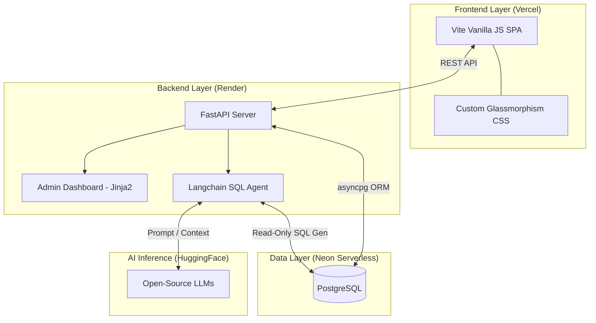

# NeuralPortfolio 🧠

<div align="center">
  <h3>A Next-Generation, AI-Powered Interactive Portfolio</h3>
  <p>Where Full-Stack Engineering Meets Generative AI.</p>
</div>

---

## 🌟 Overview

NeuralPortfolio is not a static webpage. It is a **living, dynamic web application** engineered to showcase projects, achievements, and real-time thoughts. More importantly, it acts as an autonomous digital representative. 

Integrated with a powerful **LangChain SQL Agent**, recruiters and visitors can chat directly with the portfolio. The AI understands natural language, queries the live PostgreSQL database in real-time, and provides accurate, personalized answers about the candidate's skills, projects, and history.

---

## 🏗️ Architecture

NeuralPortfolio utilizes a decoupled frontend architecture talking to a monolithic, AI-integrated FastAPI backend. 



### 📂 Directory Structure

```text
NeuralPortfolio/
├── backend/                        # 🧠 Backend Application
│   ├── app/
│   │   ├── authentication/         # JWT logic and Bcrypt hashing
│   │   ├── chatbot/                # Langchain SQL Agent & Prompts
│   │   ├── models/                 # SQLModel Database Schemas
│   │   ├── routers/                # FastAPI Endpoints
│   │   ├── templates/              # Jinja2 HTML Admin Dashboard
│   │   ├── utils/                  # Helper functions
│   │   ├── database.py             # Async DB Connection config
│   │   └── main.py                 # FastAPI Application Entry
│   ├── frontend-admin/             # Static Assets for Admin UI
│   ├── requirements.txt            # Python Dependencies
│   └── run.py                      # Uvicorn entry script
│
├── frontend-user/                  # 🎨 Frontend User Application
│   ├── index.html                  # Profile & Resume Page
│   ├── projects.html               # Projects Showcase
│   ├── achievements.html           # Achievements Showcase
│   ├── chitchat.html               # Micro-blogging feed
│   ├── script.js                   # API Integration Logic
│   ├── style.css                   # Global Design System
│   └── vite.config.js              # Vite Bundler config
│
└── .gitignore                      # Git ignored files
```

---

## 💡 How It Defies the Norm

Most developer portfolios are static sites built with React/Next.js or Hugo. While they look nice, they don't showcase *backend engineering* or *AI integration*. NeuralPortfolio aims to be fundamentally different:

1. **The Chatbot Knows The Database:** Unlike standard RAG (Retrieval-Augmented Generation) which just searches text documents, this AI acts as an autonomous data analyst. When you ask it *"What projects did he build using Python?"*, the Langchain agent writes a secure SQL query, hits the database, parses the results, and talks back to you.
2. **The Chit-Chat System:** A built-in micro-blogging platform where posts can have a "vanishing date", automatically disappearing from the feed. It keeps the portfolio feeling alive and actively maintained.
3. **Fully Custom CMS:** NeuralPortfolio comes with its own secure Admin Dashboard. Adding a new project or updating a bio doesn't require pushing new code—it's done through a beautiful, authenticated internal UI.

---

## 🛠️ Key Skills Showcased

- **Generative AI & LLMs:** Langchain, HuggingFace Inference, Prompt Engineering, ReAct Agent paradigms.
- **Backend Engineering:** FastAPI, Python, Asynchronous programming (`asyncio`), API Route modularization.
- **Database Architecture:** PostgreSQL, Neon Serverless, SQLModel, asyncpg. 
- **Security:** JWT (JSON Web Tokens) Authentication, Password Hashing (Bcrypt), CORS management, secure environment variable orchestration.
- **Frontend Development:** Vite, Vanilla JavaScript, DOM Manipulation, CSS3 (Glassmorphism, Animations, Flexbox/Grid).
- **DevOps & Deployment:** Render (Web Services), Vercel, Git.

---

## 🧗 Challenges Conquered

1. **Hallucination Prevention in the SQL Agent:** 
   *Challenge:* Language models often hallucinate SQL syntax or guess table names that don't exist. 
   *Solution:* Implemented highly strict `SYSTEM_PREFIX` prompts, providing the agent with exact DDL (Data Definition Language) rules and forcing it to only query approved tables using the `SQLDatabaseToolkit`.

2. **Asynchronous ORM with Langchain:** 
   *Challenge:* The backend uses `asyncpg` for high-performance async database operations, but Langchain's SQL toolkit requires a synchronous database connection.
   *Solution:* Designed a dual-engine architecture where FastAPI routes leverage the async session maker, while the `code.py` AI module spins up a secondary synchronous `psycopg2` driver explicitly for the agent's read-only queries.

3. **Secure Monolithic/Microservice Hybrid Design:** 
   *Challenge:* Hosting a decoupled User Frontend on Vercel while keeping the Admin Dashboard deeply integrated into the backend.
   *Solution:* The backend mounts the Admin Dashboard via Jinja2 templates and a protected `/static` directory for internal styling, completely isolating the Admin panel from the public Vite frontend API consumers.

---

<div align="center">
  <i>Built with passion, caffeine, and AI.</i>
</div>
